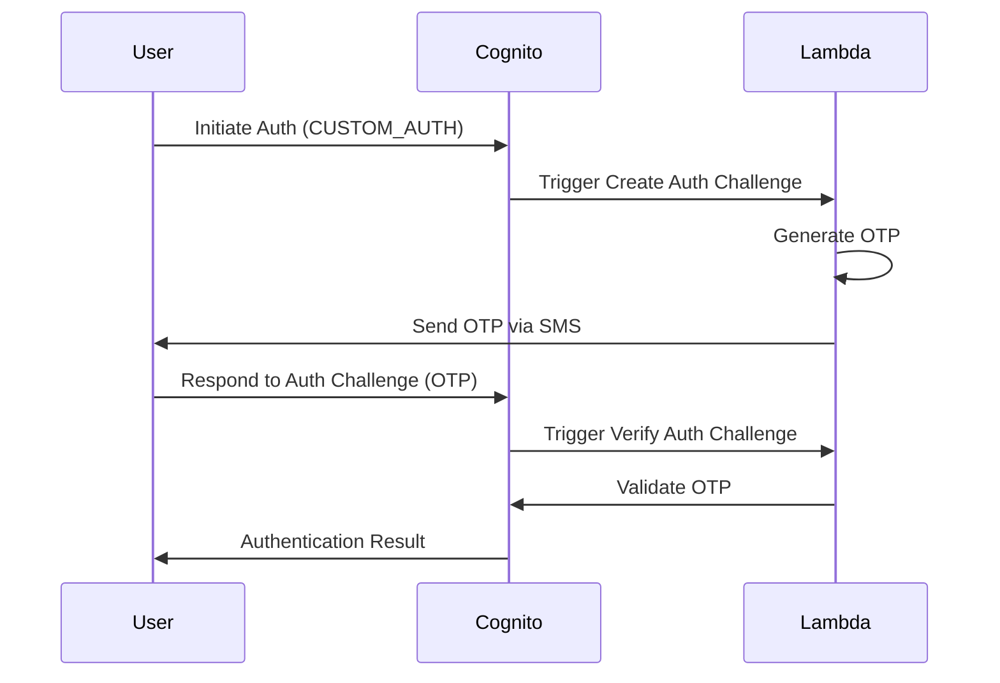

# AWS Cognito Setup for Email/Password and Phone/OTP-Based Login Using Custom Authentication

This guide provides detailed steps to set up AWS Cognito for email/password and phone/OTP-based login using custom authentication. The setup includes necessary commands and examples to help you configure and use AWS Cognito.

## Prerequisites

- AWS account with access to Cognito services
- AWS CLI installed and configured
- Node.js and npm installed
- Basic knowledge of AWS Cognito, Lambda, and Node.js

## Setup Instructions

### 1. AWS Cognito User Pool Configuration

1. **Create a User Pool:**

   - Go to the [Cognito Dashboard](https://console.aws.amazon.com/cognito/home).
   - Click on **Manage User Pools** and then **Create a user pool**.
   - Follow the steps to create a user pool with the desired settings for attributes, policies, etc.

2. **Create an App Client:**

   - In the Cognito User Pool, go to **App clients** and click **Add an app client**.
   - Provide a name for your app client and configure it as needed.
   - Ensure to enable the **CUSTOM_AUTH** flow under **Auth Flows Configuration**.

### 2. AWS Lambda Functions for Custom Authentication

1. **Create Lambda Functions:**

   - Create a Lambda function that handles the custom authentication challenge and OTP verification.

2. **Lambda Function Content:**

   The function provided in `lambda_function.py` handles the custom authentication logic:

   ```python
   import json
   import boto3
   import random

   def lambda_handler(event, context):
       print("RECEIVED event: ", json.dumps(event, indent=2))

       if event['triggerSource'] == 'CreateAuthChallenge_Authentication':
           handle_create_auth_challenge(event)
       elif event['triggerSource'] == 'DefineAuthChallenge_Authentication':
           handle_define_auth_challenge(event)
       elif event['triggerSource'] == 'VerifyAuthChallengeResponse_Authentication':
           handle_verify_auth_challenge(event)

       print("RETURNED event: ", json.dumps(event, indent=2))
       return event

   def handle_create_auth_challenge(event):
       phone_number = event['request']['userAttributes'].get('phone_number')

       if (not event['request']['session'] or
               (event['request']['session'] and event['request']['session'][-1]['challengeName'] == 'SRP_A') or
               len(event['request']['session']) == 0):

           pass_code = random.randint(100000, 999999)  # 6 digits passcode generation
           send_sms(phone_number, pass_code)
       else:
           previous_challenge = event['request']['session'][-1]
           pass_code = previous_challenge['challengeMetadata'].split('-')[1]

       event['response']['publicChallengeParameters'] = {
           'phone': phone_number,
       }
       event['response']['privateChallengeParameters'] = {
           'passCode': pass_code
       }
       event['response']['challengeMetadata'] = f'CODE-{pass_code}'

   def handle_define_auth_challenge(event):
       if event['request'].get('userNotFound', False):
           print('User does not exist')
           event['response']['issueTokens'] = False
           event['response']['failAuthentication'] = True
           raise Exception('User does not exist')

       if (event['request']['session'] and
               len(event['request']['session']) and
               event['request']['session'][-1]['challengeName'] == 'SRP_A'):
           event['request']['session'] = []
           event['response']['issueTokens'] = False
           event['response']['failAuthentication'] = False
           event['response']['challengeName'] = 'CUSTOM_CHALLENGE'
       elif (event['request']['session'] and
             len(event['request']['session']) and
             event['request']['session'][-1]['challengeName'] == 'CUSTOM_CHALLENGE' and
             event['request']['session'][-1]['challengeResult']):
           print('The user provided the right answer to the challenge')
           event['response']['issueTokens'] = True
           event['response']['failAuthentication'] = False
       elif (event['request']['session'] and
             len(event['request']['session']) >= 3 and
             not event['request']['session'][-1]['challengeResult']):
           print('FAILED Authentication: The user provided a wrong answer 3 times')
           event['response']['issueTokens'] = False
           event['response']['failAuthentication'] = True
           raise Exception('Invalid OTP')
       else:
           event['response']['issueTokens'] = False
           event['response']['failAuthentication'] = False
           event['response']['challengeName'] = 'CUSTOM_CHALLENGE'

   def handle_verify_auth_challenge(event):
       expected_answer = event['request']['privateChallengeParameters'].get('passCode')

       if event['request']['challengeAnswer'] == expected_answer:
           event['response']['answerCorrect'] = True
       else:
           event['response']['answerCorrect'] = False

   def send_sms(phone_number, pass_code):
       sns = boto3.client('sns')
       message = f'Your secret code: {pass_code}'
       response = sns.publish(
           PhoneNumber=phone_number,
           Message=message,
       )
       print(f'SMS sent to {phone_number}, response: {response}')
   ```

3. **Deploy Lambda Functions:**

   - Deploy the Lambda functions using the AWS Management Console or AWS CLI.

4. **Set Up Triggers in Cognito:**

   - Go to your Cognito User Pool.
   - Click on **Triggers**.
   - Set the following triggers to point to the Lambda function created above:
     - **Define Auth Challenge**
     - **Create Auth Challenge**
     - **Verify Auth Challenge Response**

### 3. AWS Cognito Identity Pool Configuration

1. **Create an Identity Pool:**

   - Go to the [Cognito Dashboard](https://console.aws.amazon.com/cognito/home).
   - Click on **Manage Identity Pools** and then **Create new identity pool**.
   - Link the identity pool to the user pool and app client created earlier.

### 4. Environment Configuration

1. **Create a `.env` File:**

   - Create a `.env` file in your project root directory with the following content:

     ```
     REACT_APP_AWS_REGION="your-aws-region"
     REACT_APP_COGNITO_USER_POOL_ID="your-user-pool-id"
     REACT_APP_COGNITO_CLIENT_ID="your-client-id"
     REACT_APP_COGNITO_IDENTITY_POOL_ID="your-identity-pool-id"
     ```

### 5. Node.js Application Setup

1. **Install Dependencies:**

   ```bash
   npm install
   ```

2. **Run the Application:**

   ```bash
   npm start
   ```

## AWS CLI Commands for Cognito

### Normal Login via AWS CLI

Use the following command to initiate authentication using the CUSTOM_AUTH flow:

```bash
aws cognito-idp initiate-auth \
    --client-id your-client-id \
    --auth-flow CUSTOM_AUTH \
    --auth-parameters USERNAME=dummyuser@example.com,PASSWORD=""
```

### Password-Based Login via AWS CLI

Use the following command to initiate authentication using the USER_PASSWORD_AUTH flow:

```bash
aws cognito-idp initiate-auth \
    --auth-flow USER_PASSWORD_AUTH \
    --client-id your-client-id \
    --auth-parameters USERNAME=dummyuser@example.com,PASSWORD=yourpassword
```

### Respond to Authentication Challenge

Use the following command to respond to the custom authentication challenge:

```bash
aws cognito-idp respond-to-auth-challenge \
    --client-id your-client-id \
    --challenge-name CUSTOM_CHALLENGE \
    --session "session-string" \
    --challenge-responses USERNAME=dummyuser@example.com,ANSWER=123456
```

Replace `your-client-id`, `dummyuser@example.com`, `yourpassword`, `session-string`, and `123456` with appropriate values.

## Example Project Structure

```
aws-cognito-phone-passwordless-login/
├── lambda_functions/
│   └── lambda_function.py
├── public/
├── src/
├── .env
├── package.json
├── package-lock.json
└── README.md
```

For detailed implementation, refer to the source code in this repository.

## Authentication Flow Diagram

Below is a flow diagram explaining how the passwordless authentication flow works in AWS Cognito.


